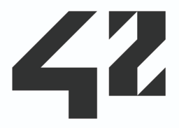

<a href="https://www.youtube.com/watch?v=Oz_VMhNBpak&list=PL_zYbCWaNF7GNl4vMvyzbuaPQw9lTh8wY">
    

        Youtube playlist ⇗
    

</a>

    Some school projects

## First things first, what is 42 ? [website ⇗](https://42.fr/en/homepage/)
| | |
| ----------- | --- |
|  | 
❝ 42 is a future-proof computer science training to educate the next generation of software engineers. The 42 program takes a project-based approach to progress and is designed to develop technical and people skills that match the expectations of the labor market. ❞
 |

My feedback after doing this school :

  
English

  

  At 42, there is no one to tell us what to do or what to learn.
The difference with a traditional school is that we have no one behind us to tell us how to do things. No classes, no teachers, we are totally free to work on what we want from a list of projects.
We have to search ourselves, learn by testing and experimenting, also with the help of others students if needed. In fact, we are taught to learn. Google can give us answers, and even if we can't find anything, there are many forums where we can ask our questions (stackoverflow, openclassroom, developper.com, etc) as well as the school's internal forum.
In addition to this ability to learn on our own, we learned to manage our time, our ability to work with deadlines, as well as working on a project with colleagues (distribution of tasks, versioning via github, etc).
  

  So even if we don't know a technology, it's not a problem because we can adapt very quickly, we have a very good autonomy. In addition, 100% of our working time is dedicated to programming or any other knowledge that would help us on our projects, there are no general subjects imposed. At the start of the course, the C language is imposed in order to have a low-level approach to programming and an in-depth knowledge of the use of machine resources, a few projects in assembler are also offered. Overall, we develop a sensitivity to the languages/tools and their implications with the machine to select and use the most suitable for our project.
  During their course, students are quickly confronted with increasingly complex and specialized projects. Of course, everyone's progress varies since our pace of work is free and specific to each. The pedagogical team advises us a rhythm of 60 to 90 hours per week for a "normal" progress.
  

  In other words, we are immersed in this universe throughout our course, everything works on motivation and mutual help. A student who does not like this method of work will not be able to continue. If he stays, it's because he likes how the school and its peer-learning pedagogy are.
  

  
French

  

  À 42, il n'y a personne pour nous dire quoi faire ou quoi apprendre.
La différence avec une école traditionnelle, c'est qu'on a personne derrière nous pour nous dire comment
faire. Pas de cours, pas de profs, on est totalement libre de travailler sur ce que l'on veut parmi une liste de projets.
On doit chercher nous même, apprendre en testant et en expérimentant, aussi avec l'aide d'autres
étudiants si besoin. On nous apprend à apprendre en fait. Google peut nous apporter des réponses, et
même si on ne trouve rien, il existe beaucoup de forums où poser nos questions (stackoverflow,
openclassroom, developper.com, etc) ainsi que le forum interne de l'école.
En plus de cette capacité à apprendre par nous-même, on a appris a gérer notre temps, notre capacité à
travailler avec des deadlines, ainsi que de travailler sur un projet avec des collègues (répartition des
taches, versionning via github, etc).

Donc même si on ne connais pas une technologie, ce n'est pas un problème car on peut s'adapter très vite,
on a une très bonne autonomie. De plus 100% de notre temps de travail est dédié à la programmation ou
tout autre connaissance qui nous aiderait sur nos projets, il n'y a pas de matières générales imposées.
Au début du cursus, le langage C est imposé pour avoir une approche bas niveau de la programmation et
une connaissance approfondie sur l'utilisation des ressources de la machine, quelques projets en
assembleur sont aussi proposés. Globalement, on développe une sensibilité sur les langages/outils et leur
implications avec la machine pour sélectionner et utiliser les plus adaptés à notre projet.
Au cours de leur cursus, les étudiants sont rapidement mis face à des projets de plus en plus complexes et
spécialisés. Bien sûr, la progression de chacun varie puisque notre rythme de travail est libre et propre à
chacun. L'équipe pédagogique nous conseille un rythme de 60 à 90 heures par semaines pour une
progression "normale".

Autrement dit, on est plongé dans cet univers pendant tout notre cursus, tout fonctionne à la motivation et
l'entraide. Un étudiant qui ne se plait pas dans cette méthode de travail ne pourra pas continuer. S'il reste, c'est que ça lui plait et qu'il aime l'école 42 et sa pédagogie peer-learning.
  

 
 

#  3D graphical engine - [repo ⇗](https://github.com/rhoffsch42/scop)

A simple engine to render 3D models.

 
 

#  HumanGL - [repo ⇗](https://github.com/rhoffsch42/HumanGL)

The aim of this project was to use a hierarchy of matrices to make animations.
 
 

#  Raytracing - [repo ⇗](https://github.com/rhoffsch42/rtv1)

Group project : a 3D engine using raytracing.

 
 

#  Corewar - [repo ⇗](https://github.com/rhoffsch42/Corewar)

Group project : in this game, computer programs (called "Champions") compete in a virtual arena for memory supremacy. Champions are written in an Assembly dialect called "Redcode".

 
 

#  Wolf3D game - [repo ⇗](https://github.com/rhoffsch42/Wolf3D)

A game like Wolfeinstein3D or Doom, using raycasting.

 
 

#  Fractals - [repo ⇗](https://github.com/rhoffsch42/fractals) 

The famous Mandelbrot set, Julia set, and other fractals.

 
 

#  Wireframe - [repo ⇗](https://github.com/rhoffsch42/fdf)

 Isometric wireframe visualization of a topography. A basic project to introduce the use of a graphic library.

 
 
