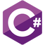

# Welcome
---

I'm a software engineer, living in France. I've been programming since 2014.
In this blog you will find some projects about graphics programming, voxels, video games, tools and add-ons for games, and more...

Take a look at :
- [Side Projects](https://rhoffsch42.github.io/side_projects.html)
- [Video game tools](https://rhoffsch42.github.io/video_game_tools.html)

---

Main techs :

Confident :

Currently learning : 

Already used :

---

-  <https://github.com/rhoffsch42>
-  <https://www.youtube.com/channel/UCgjzbalQP2kbW4fsJ14_ftQ>
-  <rhoffsch@gmail.com>
